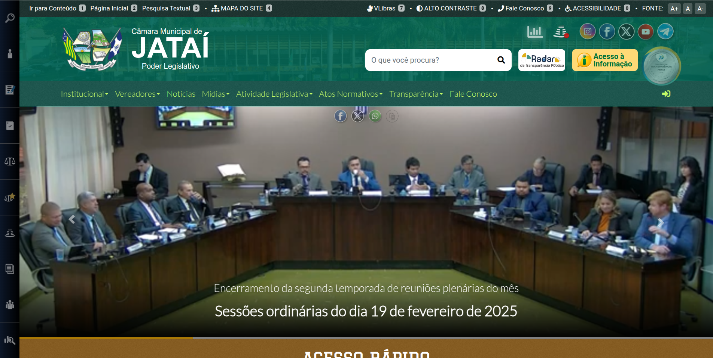

# Plano de Ação - Transparência 2025

## Objetivo Geral

O Programa Nacional de Transparência Pública (PNTP) estabelece diretrizes e obrigações para garantir a transparência ativa e passiva dos órgãos públicos. A Cartilha do PNTP define critérios e padrões para a transparência dos poderes Executivo, Legislativo e Judiciário.

A Câmara Municipal de Jataí, como órgão do Poder Legislativo, deve cumprir as obrigações comuns e específicas da Cartilha do PNTP, garantindo a transparência em todos os níveis de sua atuação.

Este plano de ação tem como objetivo adequar a Câmara Municipal de Jataí às diretrizes do PNTP, assegurando a transparência ativa e passiva conforme as obrigações comuns e específicas do Poder Legislativo.

### Objetivos Específicos

* Implementar as diretrizes da Cartilha do PNTP, garantindo a transparência ativa e passiva.
* Assegurar a disponibilização de informações essenciais, obrigatórias e recomendadas.
* Promover a transparência ativa e passiva em todos os níveis da Câmara Municipal de Jataí.
* Fortalecer o controle social e a confiança da sociedade na gestão pública.
* Garantir a conformidade com a legislação vigente e as melhores práticas de transparência.
* Monitoramento contínuo com priorização máxima nos itens essenciais e obrigatórios.
* Colaboração e engajamento de todos os departamentos e servidores.
* Aproveitamento máximo de ferramentas e soluções digitais existentes.

### Missão

Conquistar o Selo Diamante do Programa Nacional de Transparência Pública (PNTP) em 2025. O Selo Diamante é a mais alta distinção de transparência concedida pelo PNTP e atesta o cumprimento de todas as obrigações.

### Visão

Ser reconhecidamente um órgão público transparente, acessível e confiável, promovendo a participação cidadã e o controle social.

### Valores

* Transparência
* Ética
* Responsabilidade
* Inovação
* Colaboração
* Comprometimento

## FASES DO PLANO DE AÇÃO

### Fase 1: Diagnóstico e Planejamento

* **Atividade:** Estudo da Cartilha do PNTP, descartando recomendações exclusivas de outros poderes e identificando as obrigações comuns e específicas ao Poder Legislativo.

  * **Responsável:** DDE e Controle Interno

  * **Produtos:**
    * Lista consolidada das obrigações do Poder Legislativo, com base na Cartilha.
    * Checklist com as lacunas atuais do portal da Câmara, comparando com as exigências da Cartilha.

* **Atividade:** Reunião com os chefes de departamento para apresentar o PNTP e o plano de ação.

  * **Responsável:** Gestor Público

  * **Produtos:**
    * Conscientização e engajamento da equipe.
    * Definição de responsabilidades por departamento e cargo.

* **Atividade:** Elaboração do cronograma detalhado de implementação, definindo prazos realistas para cada item.

  * **Responsável:** Gestor Público e Chefes de Departamento

  * **Produtos:** Cronograma com metas e prazos claros.

### Fase 2: Implementação das Obrigações Essenciais

Os critérios classificados como “essenciais” são aqueles referentes a informações da execução orçamentária e financeira que se o Poder ou órgão deixar de dar transparência, fica impedido de receber transferências voluntárias e contratar operações de crédito, de acordo com os arts. 48 e 48-A c/c o art. 51 da Lei Complementar nº
101/2000.

O Poder Legislativo possui 11 critérios essenciais que se desdobram em 21 subcritérios.

A implementação de 100% dos critérios essenciais é requisito mínimo para a obtenção de qualquer dos Selos de Qualidade da Transparência Pública.

#### Informações Prioritárias

* **Atividade 1.1:** Garantir a existência de um site oficial próprio da Câmara, com visibilidade do Portal da Transparência e ferramenta de pesquisa.

  * **Pergunta:** Possui sítio oficial próprio na internet? (p.35)
  * **Responsável:** DDE
  * **Produtos:**
    * PortalCMJ próprio em funcionamento _full-time_.
      * https://www.jatai.go.leg.br
    * Ferramenta de busca otimizada no PortalCMJ.
      * https://www.jatai.go.leg.br/pesquisar

* **Atividade 1.2:**
  * **Pergunta:** Possui portal da transparência próprio ou compartilhado na internet? (p. 36)
  * **Responsável:** DDE
  * **Produtos:**
    * Verificação da visibilidade do Portal da Transparência na página principal do PortalCMJ.
      * https://www.jatai.go.leg.br/transparencia/portal-de-transparencia
      

#### Receitas

* **Atividade 3.1:** Padronizar a divulgação das receitas da Câmara, destacando previsão e realização.

  * **Pergunta:** Divulga as receitas do Poder ou órgão, evidenciando sua previsão e realização? (p. 44)
  * **Responsável:** ????
  * **Produtos:**
    * Publicação dos dados de receitas com detalhamento orçamentário e natureza da receita.
    * Implementação de ferramentas de pesquisa por período e tipo de receita.

### Fase 3: Implementação das Obrigações Específicas do Poder Legislativo

...

### Fase 4: Implementação das Recomendações e Melhoria Contínua

...

## Considerações Finais

Este plano de ação será um guia para a Câmara Municipal de Jataí alcançar os mais altos padrões de transparência, garantindo o controle social e a confiança da sociedade. O compromisso de todos os envolvidos, a análise contínua e a busca por melhoria contínua são essenciais para o sucesso desta iniciativa.
